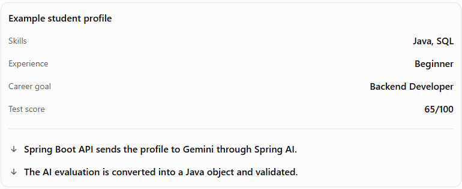
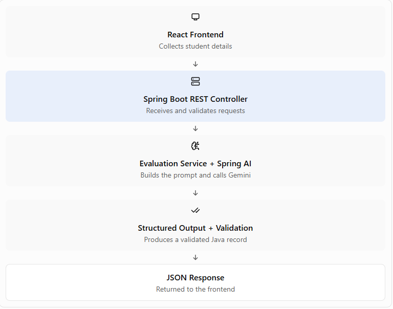
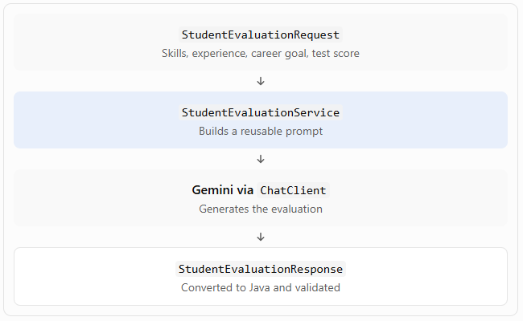
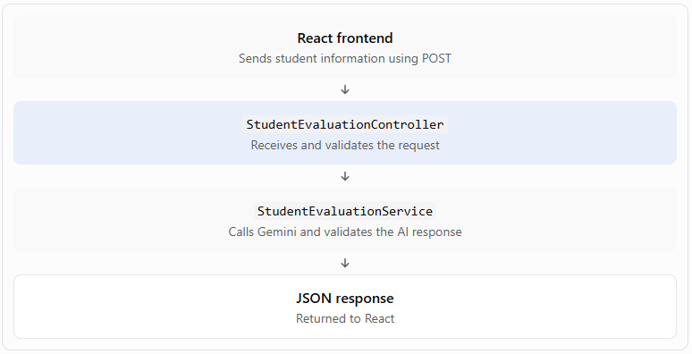

# Phase 2.15 — Mini Project: AI Student Evaluator

Phase 2

Mini Project

Spring Boot + Spring AI + Gemini

Goal: Build a REST API that evaluates a student's current skills against their career goal and returns structured feedback that your React frontend can use.

## 1. What are we building?





The API could return JSON like this:

JSON

```
{
  "careerGoal": "Backend Developer",
  "score": 65,
  "skillGaps": [
    "Spring Boot REST APIs",
    "Database design",
    "Unit testing"
  ],
  "recommendation": "Build a REST API project and practise testing."
}
```

This is an illustrative response, not a guaranteed Gemini output. Your application must validate the actual response.

## 2. Project architecture



Why use this structure? The controller handles HTTP requests, the service handles AI-related logic, and the Java record defines the data shape. Keeping those responsibilities separate makes the feature easier to test and maintain.


## 3. Step 1 — Create the Java data models

We'll start with the foundation: defining what information the API accepts and what the AI should return.

### A. Create the request record

Create `StudentEvaluationRequest.java`:

Java

```
package com.example.career.dto;

import jakarta.validation.constraints.Max;
import jakarta.validation.constraints.Min;
import jakarta.validation.constraints.NotBlank;
import jakarta.validation.constraints.NotEmpty;
import jakarta.validation.constraints.Size;

import java.util.List;

public record StudentEvaluationRequest(

    @NotEmpty
    @Size(max = 20)
    List<@NotBlank String> skills,

    @NotBlank
    String experience,

    @NotBlank
    String careerGoal,

    @Min(0)
    @Max(100)
    int testScore

) {}
```

What does this do?

* `skills`: accepts a list such as `["Java", "SQL"]`.

* `experience`: accepts the student's experience level.

* `careerGoal`: defines the student's target career.

* `testScore`: accepts only values from 0 to 100 when validation is triggered.

* The annotations define validation rules; we'll activate validation when we build the controller.

### B. Create the response record

Create `StudentEvaluationResponse.java`:

Java

```
package com.example.career.dto;

import jakarta.validation.constraints.Max;
import jakarta.validation.constraints.Min;
import jakarta.validation.constraints.NotBlank;
import jakarta.validation.constraints.NotEmpty;
import jakarta.validation.constraints.Size;

import java.util.List;

public record StudentEvaluationResponse(

    @NotBlank
    String careerGoal,

    @Min(0)
    @Max(100)
    int score,

    @NotEmpty
    @Size(min = 3, max = 3)
    List<@NotBlank String> skillGaps,

    @NotBlank
    String recommendation

) {}
```

Here, `score` represents the student's supplied test score in this version of our project. We can later distinguish the test score from an AI-generated career-readiness assessment if we want both.

The `@Size(min = 3, max = 3)` rule requires exactly three skill gaps when response validation is triggered.

### C. Add the validation dependency

If it isn't already in your Maven project, add this to `pom.xml`:

XML

```
<dependency>
    <groupId>org.springframework.boot</groupId>
    <artifactId>spring-boot-starter-validation</artifactId>
</dependency>
```

Maven will use the compatible version managed by your Spring Boot parent or dependency management.

//Part 2

# Step 2 — Build the AI Evaluation Service 🤖

Now we reach the core of the project: connecting your student's data to Gemini through Spring AI and converting the response into a Java object.

Our service will perform four jobs:

1. Receive the student's profile.

2. Build a prompt using the student's information.

3. Call Gemini through Spring AI's `ChatClient`.

4. Convert and validate the AI response.

## 1. Understand the flow



## 2. Create `StudentEvaluationService.java`

Use the same package structure as your DTOs. For example, if your DTOs are in `com.example.career.dto`, create this service in `com.example.career.service`.

Java

```
package com.example.career.service;

import com.example.career.dto.StudentEvaluationRequest;
import com.example.career.dto.StudentEvaluationResponse;

import jakarta.validation.ConstraintViolation;
import jakarta.validation.Validator;

import org.springframework.ai.chat.client.ChatClient;
import org.springframework.stereotype.Service;

import java.util.Set;
import java.util.stream.Collectors;

@Service
public class StudentEvaluationService {

    private final ChatClient chatClient;
    private final Validator validator;

    public StudentEvaluationService(
            ChatClient.Builder chatClientBuilder,
            Validator validator) {

        this.chatClient = chatClientBuilder.build();
        this.validator = validator;
    }

    private static final String EVALUATION_PROMPT = """
        You are an experienced backend career advisor.

        Student information:
        Skills: {skills}
        Experience: {experience}
        Career goal: {careerGoal}
        Test score: {testScore}

        Task:
        Analyze the student's skills against the career goal.

        Rules:
        - Identify exactly 3 relevant technical skill gaps.
        - Prioritize the most important gaps.
        - Give one concise, practical recommendation.
        - Do not invent skills or experience.
        - Copy the student's test score exactly into the score field.
        - Use the requested response structure.
        """;

    public StudentEvaluationResponse evaluate(
            StudentEvaluationRequest request) {

        StudentEvaluationResponse response =
                chatClient.prompt()
                        .user(user -> user
                                .text(EVALUATION_PROMPT)
                                .param("skills",
                                        String.join(", ", request.skills()))
                                .param("experience",
                                        request.experience())
                                .param("careerGoal",
                                        request.careerGoal())
                                .param("testScore",
                                        request.testScore()))
                        .call()
                        .entity(StudentEvaluationResponse.class);

        if (response == null) {
            throw new IllegalStateException(
                    "AI returned no evaluation.");
        }

        Set<ConstraintViolation<StudentEvaluationResponse>> violations =
                validator.validate(response);

        if (!violations.isEmpty()) {
            String errors = violations.stream()
                    .map(ConstraintViolation::getMessage)
                    .collect(Collectors.joining("; "));

            throw new IllegalStateException(
                    "AI evaluation failed validation: " + errors);
        }

        return response;
    }
}
```

This example uses the standard `ChatClient` builder and prompt-template APIs. It assumes you've already configured the Spring AI Gemini model and added the validation dependency in Step 1.


## 3. Understand the important parts

### A. Why inject `ChatClient.Builder`?

Java

```
public StudentEvaluationService(
        ChatClient.Builder chatClientBuilder,
        Validator validator) {
    this.chatClient = chatClientBuilder.build();
    this.validator = validator;
}
```

Spring Boot provides the configured builder when your Spring AI model setup is correct. We build a `ChatClient` to make requests to Gemini without manually handling HTTP requests to the model API.

### B. How does the prompt template work?

Java

```
.user(user -> user
    .text(EVALUATION_PROMPT)
    .param("skills", String.join(", ", request.skills()))
    .param("experience", request.experience())
    .param("careerGoal", request.careerGoal())
    .param("testScore", request.testScore()))
```

The values replace the corresponding placeholders. For a student with Java and SQL skills, `{skills}` becomes `Java, SQL`.

This makes the prompt reusable for different students instead of hardcoding one student's details.

### C. What does `.entity()` do?

Java

```
.call()
.entity(StudentEvaluationResponse.class);
```

The sequence is:

* `.call()` executes the model request.

* `.entity(StudentEvaluationResponse.class)` asks Spring AI to convert the response into your Java record.

* `validator.validate(response)` checks whether the resulting object satisfies its validation constraints.

Important: `.entity()` does not guarantee that the response is correct or valid. Prompt instructions also do not guarantee exactly three skill gaps. Our validation catches certain structural and data-rule violations, but it cannot determine whether career advice is factually good.


//Part 3
# Step 3 — Create the REST Controller 🌐

Now let's expose your AI evaluation service through an HTTP API so your React frontend can communicate with it.

## 1. What is a REST controller?

A REST controller receives HTTP requests, calls the appropriate service, and returns a response—usually JSON.

For our project, the flow is:



## 2. Write the controller

Create `StudentEvaluationController.java` inside `com.example.career.controller`.

Java

```
package com.example.career.controller;

import com.example.career.dto.StudentEvaluationRequest;
import com.example.career.dto.StudentEvaluationResponse;
import com.example.career.service.StudentEvaluationService;

import jakarta.validation.Valid;

import org.springframework.web.bind.annotation.*;

@RestController
@RequestMapping("/api/evaluations")
public class StudentEvaluationController {

    private final StudentEvaluationService evaluationService;

    public StudentEvaluationController(
            StudentEvaluationService evaluationService) {
        this.evaluationService = evaluationService;
    }

    @PostMapping
    public StudentEvaluationResponse evaluateStudent(
            @Valid @RequestBody StudentEvaluationRequest request) {

        return evaluationService.evaluate(request);
    }
}
```

### Understand the important annotations

| Annotation                            | Purpose                                                                                            |
| ------------------------------------- | -------------------------------------------------------------------------------------------------- |
| `@RestController`                     | Marks the class as a REST controller; returned objects are serialized into the HTTP response body. |
| `@RequestMapping("/api/evaluations")` | Defines the common URL path.                                                                       |
| `@PostMapping`                        | Handles HTTP POST requests at that path.                                                           |
| `@RequestBody`                        | Converts incoming JSON into a `StudentEvaluationRequest` object.                                   |
| `@Valid`                              | Triggers Bean Validation on the incoming request.                                                  |

Notice that `@Valid` here validates the student's incoming request. Our service separately validates the AI-generated response.

## 3. Test your API

Start your Spring Boot application, then send a POST request to:

`http://localhost:8080/api/evaluations`

You can use Postman, or run this cURL command in a terminal:

Bash

```
curl -X POST http://localhost:8080/api/evaluations \
  -H "Content-Type: application/json" \
  -d '{
    "skills": ["Java", "SQL"],
    "experience": "Beginner",
    "careerGoal": "Backend Developer",
    "testScore": 65
  }'
```

If your application and Gemini configuration are working, the response should resemble:

JSON

```
{
  "careerGoal": "Backend Developer",
  "score": 65,
  "skillGaps": [
    "Spring Boot REST APIs",
    "Database design",
    "Unit testing"
  ],
  "recommendation": "Build and test a Spring Boot REST API."
}
```

The actual recommendations may differ because Gemini generates the response dynamically.

What if the request is invalid? For example, if `testScore` is `150`, request validation should reject it before the controller invokes the evaluation service. Spring MVC typically returns HTTP `400 Bad Request` for this validation failure.

One production consideration: our service currently throws an exception if the AI response fails validation. We'll improve error handling so unexpected AI failures can be returned cleanly instead of producing an uncontrolled server error.


//Part 4
# Step 4 — Test the API and Handle Errors 🧪

This is our final step in the mini project! We'll verify that the API works, handle common failures, and make the endpoint more reliable.

## 1. Test a successful evaluation

Start your Spring Boot application and send this request using Postman or cURL:

Bash

```
curl -X POST http://localhost:8080/api/evaluations \
  -H "Content-Type: application/json" \
  -d '{
    "skills": ["Java", "SQL"],
    "experience": "Beginner",
    "careerGoal": "Backend Developer",
    "testScore": 65
  }'
```

Expected behavior:

1. Spring converts the JSON into `StudentEvaluationRequest`.

2. `@Valid` checks the request.

3. The service builds the prompt and calls Gemini.

4. Spring AI converts the result into `StudentEvaluationResponse`.

5. The service validates the response.

6. The controller returns the result as JSON.

Your actual response depends on the model output. This test requires a working Gemini API key, model configuration, and network access.

## 2. Handle invalid requests

Try sending a test score of `150`. Because the request record specifies `@Max(100)`, the request should fail validation before Gemini is called.

Let's provide a useful error response rather than relying on Spring's default error body.

Create `GlobalExceptionHandler.java` in `com.example.career.exception`:

Java

```
package com.example.career.exception;

import org.springframework.http.HttpStatus;
import org.springframework.http.ResponseEntity;
import org.springframework.web.bind.MethodArgumentNotValidException;
import org.springframework.web.bind.annotation.ExceptionHandler;
import org.springframework.web.bind.annotation.RestControllerAdvice;

import java.util.Map;
import java.util.stream.Collectors;

@RestControllerAdvice
public class GlobalExceptionHandler {

    @ExceptionHandler(MethodArgumentNotValidException.class)
    public ResponseEntity<Map<String, String>> handleInvalidRequest(
            MethodArgumentNotValidException ex) {

        String message = ex.getBindingResult()
                .getFieldErrors()
                .stream()
                .map(error ->
                        error.getField() + ": " + error.getDefaultMessage())
                .collect(Collectors.joining("; "));

        return ResponseEntity.badRequest().body(
                Map.of(
                        "error", "Invalid request",
                        "message", message
                )
        );
    }

    @ExceptionHandler(IllegalStateException.class)
    public ResponseEntity<Map<String, String>> handleEvaluationFailure(
            IllegalStateException ex) {

        return ResponseEntity.status(HttpStatus.BAD_GATEWAY).body(
                Map.of(
                        "error", "Evaluation failed",
                        "message",
                        "The AI evaluation could not be completed or validated."
                )
        );
    }
}
```

Now invalid incoming requests return HTTP `400 Bad Request`. The service's `IllegalStateException` returns HTTP `502 Bad Gateway`, with a generic message rather than exposing internal details.

For production, also handle model-provider exceptions and conversion errors explicitly, log technical details securely on the server, and avoid returning raw exception messages to clients.


